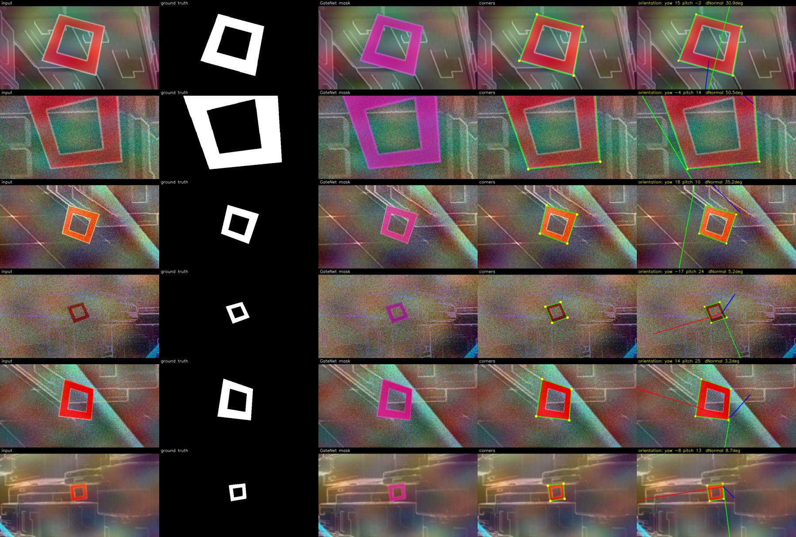
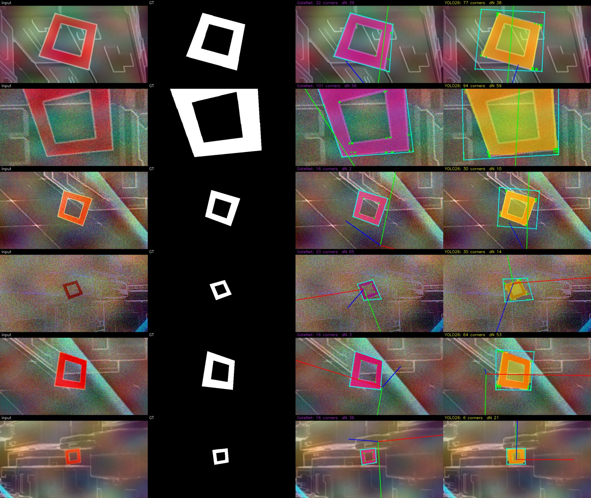

# Results — GateNet vs YOLO26 on `ai_gp_gate_6000`

Fine-tuning results on the synthetic drone-racing gate dataset, both backends
evaluated on the **same held-out 600-image test split**.

## Setup
- **Data:** `ai_gp_gate_6000` (sam3-autolabeler), imported via `scripts/import_data.py`
  → train 4800 / val 600 / **test 600** (shared across backends).
- **Hardware:** Apple M4 Pro (MPS). These are laptop **proof** runs — for
  production, run the same commands on the remote GPU (see notes below).

## Models
| | GateNet | YOLO26n |
|---|---|---|
| Type | Lightweight deep-supervised U-Net | Ultralytics instance segmentation |
| Params | ~1.75M (f=4) | ~2.7M |
| Train | 384px, 20 epochs | 320px, 10 epochs |
| Checkpoint | `runs/gatenet_synth/best.pt` | `yolo26/gate6000-n320/weights/best.pt` |

## Metrics (test set, 600 images)

| Metric | **GateNet** | **YOLO26n** |
|---|---|---|
| Frame-mask **IoU** | **0.941** | 0.619 |
| Dice | **0.969** | 0.764 |
| Precision | 0.971 | 0.631 |
| Recall | 0.968 | 0.972 |
| Pixel accuracy | 0.998 | 0.966 |
| Box mAP50 | — | 0.994 |
| Mask mAP50 / mAP50-95 | — | 0.994 / 0.976 |

Raw JSON: [`results/eval_gatenet.json`](results/eval_gatenet.json),
[`results/eval_yolo.json`](results/eval_yolo.json).

## Visual comparison


*Columns: input · ground-truth frame mask · GateNet (purple) · YOLO26 (yellow).
GateNet predicts the precise thin frame; YOLO fills the gate region more coarsely.*

## Orientation extraction (GateNet → corners → PnP)

GateNet's mask feeds the perception chain `clean_mask → quad corners → PnP`
(`perception/pose.py`) to recover the gate's **6-DoF pose** — corners, plane
normal, roll/pitch/yaw, and distance — the quantities the onboard state
estimator needs. Evaluated against the autolabeler ground truth
(`orientation_cam_rpy_deg`, `normal_cam`):

| Orientation metric (200 test frames) | value |
|---|---|
| Gate-detected rate | **0.995** |
| Plane-normal error, **median** | **8.7°** |
| Plane-normal error, mean | 19.9° |

The mean is inflated by the well-known **planar-square PnP tilt ambiguity** on
near-fronto-parallel gates (two nearly-equivalent pose solutions); the median is
the representative accuracy. Raw: [`results/eval_orientation.json`](results/eval_orientation.json).



*Columns: input · GT mask · GateNet mask (purple) · detected corners · recovered
orientation (projected gate axes + yaw/pitch and normal-error vs GT).*

### Via QuAdGate (LSD line-intersection corners)

Running both models' masks through the **QuAdGate** detector (the MonoRace
algorithm: LSD edges → line intersections → corner candidates → quad → PnP)
instead of the contour quad:

| QuAdGate orientation (150 frames) | GateNet | YOLO26 |
|---|---|---|
| Detect rate | 1.00 | 1.00 |
| Normal error, median | **19.4°** | 27.1° |
| Normal error, mean | 23.5° | 30.8° |

Both fully detect; **GateNet's clean thin-frame masks give QuAdGate better edges
than YOLO's filled masks**, so its pose is more accurate. (QuAdGate's hull-of-
candidates quad is looser than the contour quad above — 19° vs 8.7° median for
GateNet — a corner-selection trade-off.) Raw:
[`results/eval_quadgate.json`](results/eval_quadgate.json).



*Columns: input · GT · GateNet+QuAdGate · YOLO26+QuAdGate (green = QuAdGate
corner candidates, cyan = fitted quad, axes = recovered orientation).*

## Interpretation
- **GateNet wins on pixel-accurate gate segmentation** (IoU 0.94 vs 0.62). It
  directly predicts the thin gate **frame** — exactly what the onboard
  perception stack (QuAdGate → PnP) consumes — and it's the lightweight,
  Jetson-deployable model.
- **YOLO26 is a near-perfect detector** (mAP ≈ 0.99, recall 0.97): it finds
  every gate. Its lower frame-IoU is just coarser 320px polygon masks that
  over-fill the thin frame (precision 0.63), not missed gates.

The two metrics measure different things (dense frame segmentation vs.
instance detection/mAP); GateNet is optimised for the former.

## Reproduce
```bash
uv run python scripts/import_data.py --src /path/to/sam3-autolabeler/.../ai_gp_gate_6000 --link
# GateNet
uv run python scripts/train.py    --config configs/gatenet_synth.yaml --device 0
uv run python scripts/evaluate.py --model gatenet --config configs/gatenet_synth.yaml \
    --checkpoint runs/gatenet_synth/best.pt
# YOLO26
uv run --extra yolo python scripts/finetune.py --model yolo26 --variant s \
    --data data/yolo/data.yaml --epochs 100 --imgsz 640 --device 0
uv run --extra yolo python scripts/evaluate.py --model yolo26 \
    --weights yolo26/<run>/weights/best.pt --data data/yolo/data.yaml
# visual comparison
uv run --extra yolo python scripts/eval_visualize.py \
    --gatenet-config configs/gatenet_synth.yaml --gatenet-ckpt runs/gatenet_synth/best.pt \
    --yolo-weights yolo26/<run>/weights/best.pt --out docs/eval_comparison.jpg
```

> **Production:** on the remote GPU, train yolo26**s**@640 and GateNet@384/f4 for
> the full schedules — both metrics will rise further.
