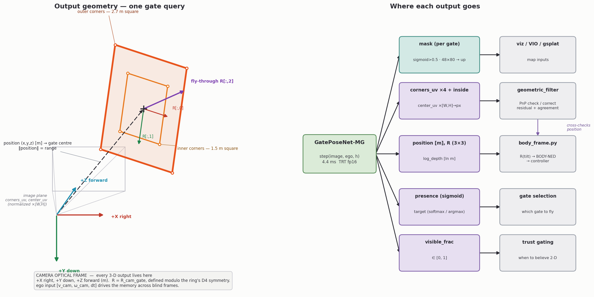
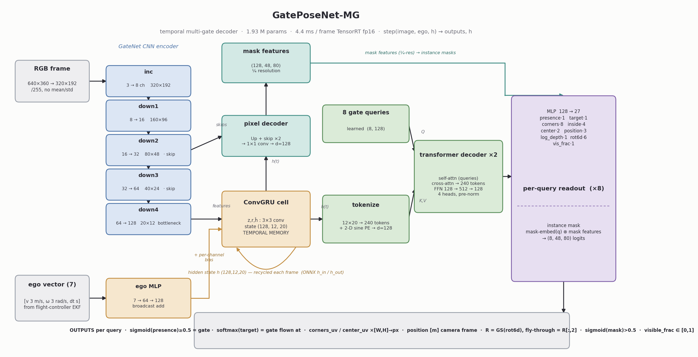

# GatePoseNet-MG — masks + keypoints + 6-DoF pose for every gate, per frame

Temporal multi-gate perception for drone racing. 1.93 M params, 4.4 ms/frame
TensorRT fp16 (228 Hz). Checkpoint, ONNX, demo video, training-data sample:
release [`gateposenet-mg-v1.0`](https://github.com/airobotics-ucberkeley/perception-model-training/releases/tag/gateposenet-mg-v1.0).

---

## INPUT

Call `model.step(image, ego, h) -> outputs, h` every frame. Same signature in
torch, ONNX, and TensorRT.

| input | shape | unit | notes |
|---|---|---|---|
| `image` | any res -> 320x192 | RGB, /255 | resized internally (INTER_AREA); no mean/std |
| `ego` | (7,) | `[v_cam m/s (3), w_cam rad/s (3), dt s]` | from FC/EKF, camera frame; v/w may be zeros (trained with 25% ego dropout); `dt` = real frame interval |
| `h` | (128, 12, 20) | activations | recurrent state; feed back verbatim; zeros to reset |

## OUTPUT — per query q of 8 (one query = one gate instance)



Frames: 3-D outputs are CAMERA OPTICAL (+X right, +Y down, +Z forward, m).
2-D outputs are image-normalized (`u = x/W`, `v = y/H`; multiply by your
frame size; values may leave [0,1] — keypoints stay defined off-screen).

| output | shape | decode | meaning |
|---|---|---|---|
| `presence_logit` | (8,) | `sigmoid` >= 0.5 | query is bound to a real gate |
| `target_logit` | (8,) | `softmax` -> `argmax` | which gate is being flown AT |
| `mask_logit` | (8, 48, 80) | `sigmoid` > 0.5, upsample | instance mask per gate |
| `corners_uv` | (8, 4, 2) | x `[W, H]` -> px | TL/TR/BR/BL outer corners; trained even off-screen/occluded |
| `corner_inside_logit` | (8, 4) | `sigmoid` | corner actually inside the frame (trust gate) |
| `center_uv` | (8, 2) | x `[W, H]` -> px | fly-through point in the image |
| `position` | (8, 3) | none | gate center, METERS, camera optical; `dist = ‖position‖` |
| `R` | (8, 3, 3) | none | `R_cam_gate` (from rot6d); fly-through axis = `R[:, 2]`; defined modulo the ring's D4 symmetry |
| `log_depth` | (8,) | `exp` -> m | redundant depth head (training stabilizer); prefer `position[2]` |
| `visible_frac` | (8,) | [0, 1] | in-frame fraction after occlusion; 0.0 = blind, outputs come from memory |
| `h` out | (128, 12, 20) | none | next frame's state |

Downstream, one call each:

- BODY-NED: `perception/body_frame.py::gate_pose_to_body(position, R, tilt_deg)` — mount detents 30/35/40/45/50/60 deg.
- Health check: `perception/geometric_filter.py::filter_gate_estimate` — rigid-square PnP residual + PnP-vs-direct agreement + manifold-snapped corners (4/3/2-corner fits).

## HOW IT WORKS (and why)

One `step()` per frame, in five moves:

1. **See** — a small CNN encoder turns the 320×192 frame into a 20×12×128
   feature grid. A CNN (not a ViT) because gates are local, high-contrast
   shapes: convolution's built-in locality learns them from far less data
   and runs far cheaper than attention over pixels.
2. **Remember** — the flight controller's ego motion `[v, ω, dt]` is fused
   into a **ConvGRU** hidden state `h` that persists frame to frame. This is
   the whole point of the design: during a fast pass-through the gate leaves
   the image for many frames, so a per-frame detector goes blind. The memory
   keeps propagating each gate's pose from motion until it reappears —
   trained explicitly on those blind frames (~0.8–1.0 m error with the gate
   fully out of view). `dt` in the input makes one set of weights valid at
   both the 30 Hz sim stream and the 90–120 Hz flight loop.
3. **Separate** — 8 learned **queries** cross-attend to the memory through a
   2-layer transformer decoder; each query latches onto one gate. This is
   how stacked and overlapping gates get split into distinct instances
   instead of one blurred blob — the queries are matched to ground-truth
   gates by Hungarian assignment during training, so they specialize.
4. **Read out** — each query emits its gate's mask, corners, center, metric
   position, and orientation. Orientation is supervised **modulo the ring's
   D4 symmetry** (a square gate looks identical under 8 rotations, so naive
   labels would fight each other), and corners are supervised **even when
   off-screen or occluded** (the synthetic labels are exact analytic
   projections), so the model learns to place keypoints it cannot see.
5. **Verify** — `geometric_filter.py` fits the known rigid 2.7 m square to
   the predicted corners: the reprojection residual flags impossible corner
   sets and cross-checks the position head. PnP is a *check on* the model,
   never the estimator — the network already does the hard inference.

Net effect: metric 6-DoF pose for every gate, stable through occlusion and
blind flight, at 228 Hz. The block diagram and per-output geometry are in
ARCHITECTURE and OUTPUT above.

## WHAT TO RUN

```bash
# setup (once)
uv sync && uv pip install scipy matplotlib

# 1. generate training data (repo: sam3-autolabeler-private; seeded, reproducible)
cd ../sam3-autolabeler-private
uv run data_processing/make_all_data.py --force --only pose report clips \
    --traj-train 280 --traj-val 40 --camera-tilt 30
python -m synthetic report --dataset data/synthetic_output/aigp_traj_train
#   ^ audit gate: gt_integrity.pinhole_consistent == true (0.0 px), roll spans ±180

# 2. train (~2 h / 60 epochs on an A6000; AMP, batch 12, 8-frame windows)
cd ../perception-model-training
uv run python scripts/train_gatepose_mg.py --config configs/gateposenet_mg.yaml
uv run tensorboard --logdir runs/gateposenet_mg/tb        # monitor

# 3. evaluate — standardized scorecard sliced by maneuver/blind/occlusion/attitude/range
uv run python scripts/run_gate_tests.py --datasets <dataset_dir>

# 4. THE VISUAL (runs/track_and_map_mg/track_map_mg.mp4) — one command
uv run python scripts/track_and_map_mg.py --video  my_flight.mp4  --fps 30
uv run python scripts/track_and_map_mg.py --frames <frame_dir>   --fps 30
uv run python scripts/track_and_map_mg.py --dataset <dataset_dir>   # + live GT telemetry / error readout

# 5. deploy (build the engine ON the target device)
uv run python deploy/export.py --checkpoint runs/gateposenet_mg/best.pt
python -m deploy.trt_runtime --build gateposenet_mg.onnx
python -m deploy.benchmark  --model gateposenet_mg.plan
```

Defaults everywhere point at `configs/gateposenet_mg.yaml` and
`runs/gateposenet_mg/best.pt` — step 4 needs only your footage.

## GENERATE THE FULL TRACKING VISUAL

`scripts/track_and_map_mg.py` produces the side-by-side
`runs/track_and_map_mg/track_map_mg.mp4` (left: per-gate masks + projected
8-corner/center keypoints + target highlight; right: top-down localization
map with per-track trails and live telemetry). Point it at whatever footage
you have — a video file, a folder of frames, or a synthetic dataset:

```bash
# a. a video file (mp4/mov/avi/mkv — frames are read straight from it)
uv run python scripts/track_and_map_mg.py --video my_flight.mp4 --fps 30

# b. a folder of extracted frames (filenames sorted = temporal order)
uv run python scripts/track_and_map_mg.py --frames path/to/frames --fps 30

# c. a synthetic dataset — adds the GROUND-TRUTH telemetry column and a
#    live per-frame position-error readout (how the demo clip was made)
uv run python scripts/track_and_map_mg.py --dataset path/to/dataset
```

Key options: `--fps` (sets `dt` for the ego/memory input — use your real
capture rate), `--out <dir>` (default `runs/track_and_map_mg`), `--fx`
(focal length in px if you know your camera; default 320), `--presence-th`
(gate confidence gate, default 0.5), `--max-frames N` (quick preview),
`--device cpu|cuda`. The MP4 is written with the `mp4v` codec; for a
web-embeddable H.264 copy: `ffmpeg -i track_map_mg.mp4 -c:v libx264
-pix_fmt yuv420p track_map_mg_h264.mp4`.

## HOW TO TRAIN (and retrain on your own)

Loop: **generate -> audit -> train -> validate on a never-seen seed.**

```bash
# held-out test set with a disjoint seed (honest validation):
cd ../sam3-autolabeler-private
python -m synthetic gen --preset aigp --trajectories 30 --pose-safe \
    --camera-frame-only --mixed-gates --camera-tilt 30 --seed 5000 \
    --bg-mode random --backgrounds data/backgrounds \
    --formats yolo_seg,masks_png --out data/synthetic_output/my_test
cd ../perception-model-training
uv run python scripts/run_gate_tests.py \
    --datasets ../sam3-autolabeler-private/data/synthetic_output/my_test
```

Per-epoch validation line: `target_pos` = median position error of the gate
the model's own target head picks (the racing quantity; selects `best.pt`),
`mask_iou` = mean per-gate instance IoU, `presence_acc` = exact gate-count
accuracy. Expected on the v3 recipe: 0.92 m after epoch 1 -> 0.35 m by
epoch 15 -> 0.23 m plateau by 55; mask IoU 0.87–0.89. A pre-existing
`best.pt` is archived with a timestamp before the first save.

| symptom | knob |
|---|---|
| rotation error high | `loss.w_rot` up; audit that data roll spans ±180 |
| blind-frame drift | `loss.blind_scale` up (default 0.3); check `ego_motion_cam` non-null in data |
| missed distant gates | `data.pose_sup_max_m` up; generate with larger `--dist-max` |
| ghost detections | `loss.w_presence` up; more multi-gate scenes |
| chunky masks | half-res mask head (~1 ms cost) |
| latency over budget | `d_model: 96`, `n_dec_layers: 1`, fewer queries |
| different gate (size/color) | edit `configs/gate_aigp.yaml` + sam3 spec; appearance via `python -m synthetic gate-texture --frames <screenshots>`; regenerate — no model change |
| fine-tune on new data | point `data.train_roots` at it, `train.lr: 1e-4`; checkpoint loads as-is |

Hygiene: never mix pre-2026-07-09 datasets (orientation-convention fix)
with newer; keep train/val/test seeds disjoint; run `python -m
synthetic._selftest` (106 checks) after any generator change.

## ARCHITECTURE



- CNN encoder (GateNet blocks) -> 20x12x128 bottleneck; ego MLP added as a
  per-channel bias; **ConvGRU** is the temporal memory. `step()` is
  simultaneously the training scan, the Python API, and the ONNX graph.
- State -> 240 tokens (+ 2-D sine PE); **8 learned gate queries** through 2
  transformer-decoder layers (d=128, 4 heads); each query owns one gate,
  Hungarian-matched to GT during training.
- Masks are MaskFormer-style: query embedding · shared 1/4-res
  pixel-decoder features — per-gate masks at negligible marginal cost.
- Why not a ViT encoder: at 35k synthetic frames + a hard latency budget,
  CNN inductive bias wins; attention is spent only on instance reasoning.
  Pretrained compact-ViT encoder is the queued sim-to-real experiment.
- Three rules that carry the accuracy: (1) **D4 symmetry-aware** rotation +
  corner supervision (a square ring has 8 indistinguishable orientations);
  (2) **privileged supervision** of off-screen/occluded corners (labels are
  exact analytic projections, so the model learns to infer hidden
  keypoints); (3) **blind-frame pose supervision**, ego-gated (0.3 weight) —
  this trains the memory: ~0.8–1.0 m blind median with the gate fully out
  of view.
- PnP is NOT in the model. The model is the estimator;
  `geometric_filter.py` only checks/corrects its keypoints.

## TRAINING DATA

Purely synthetic; labels computed, not annotated (known 2.7/1.5 m ring +
known pinhole camera -> every mask, corner, pose, visibility fraction is
analytic). Every dataset self-audits: `gt_integrity` = 0.0 px reprojection
on all current sets. v3 build = WHAT TO RUN step 1: 34,779 train / 4,993
val frames, 280/40 sequences at 30 Hz.

Sampled by design (per sequence): kinds flythrough .25 / hover .12 /
passby .08 / corkscrew .18 / loop .12 / staggered .25; roll OU sigma 8 deg
+ p=.5 uniform ±180 bias (banked/inverted); p=.35 full-sphere viewpoints
(azimuth ±180, elevation ±75); approaches 6–20 m, fly-throughs pass to
0 m; speeds 1–7 m/s; aim uniform in the central 75% of frame + OU wander
(gate never glued to the principal point); corkscrew = stacked tower,
helix r 2–3.5 m x 270–540 deg; loop r 2.2–3.5 m (65% vertical, inverted
apex); staggered 2–3 gates, 6–12 m spacing, occlusion after each pass;
layouts single .4 / cluster .35 / stacked .25, hard 3 m min spacing;
4 gate appearances incl. a texture extracted from real Q2 screenshots;
tilt FIXED 30 deg per build; intrinsics jitter ±4% focal; per-sequence
photometric profiles; motion blur from true apparent motion; `--pose-safe`
(no 2-D warps on pose data — they break the image/3-D pinhole relation).

Measured on the shipped train set: roll −180..+180 full span; elevation
−89..+90; range 0–28 m (median 3.97 m); `visible_frac` median 0.27 — 43%
of frames partially/fully blind (the memory-training signal); gates/scene
1–4; min spacing exactly 3.00 m; 88 stacked towers; 9,376 multi-gate
frames.

GT record per gate per frame (loader `gateposenet/dataset_mg.py`):
`corners` px TL/TR/BR/BL, `center_px`, `position_cam` m, `R_cam_gate`,
`normal_cam`, `visible`, `visible_frac` [0,1], `is_target` (switches at
gate-plane crossings), `ego_motion_cam` [m/s, rad/s], per-sequence `K`,
`camera_tilt_deg`, `extrinsic`, `T_world_gate`, `seq_id/seq_t/seq_kind`;
instance masks `masks/frame_NNNNN_obj_i.png`; top-level `fps`,
`frames_convention`, `camera_frame_only: true` (body fields deliberately
absent). Full randomization rationale:
`sam3-autolabeler-private/synthetic/when-generating-data.md`.

## RUNTIME

Batch 1, 320x192, hidden-state feedback included; TRT parity-verified.

| runtime | latency | rate |
|---|---|---|
| TensorRT fp16 (A6000) | 4.38 ms | 228 Hz |
| PyTorch eager fp32 (A6000) | 3.94 ms | 254 Hz |
| onnxruntime CUDA (A6000) | 4.98 ms | 201 Hz |
| Jetson Orin NX 16 GB, TRT fp16 (projected) | 6–10 ms | 100–170 Hz |

Engines must be built on the target device — JetPack 6 / TensorRT 10
recipe and version pins in `deploy/README.md`. Deployment runtime
(`deploy/trt_runtime.py::GatePoseTRT`, ORT fallback interface-identical)
needs only numpy + cv2 + TensorRT — no torch.

## LIMITATIONS / FOLLOW-UPS

- Close-range corner drift on real footage (masks/distances hold up
  better) -> real-data fine-tune / pretrained-ViT-encoder experiment.
- Mask edges chunky at 1/4 res -> half-res head, ~1 ms.
- Distant-gate presence misses near the 25 m supervision radius.
- Pre-2026-07-09 datasets carry the old orientation convention — regenerate.

Status and sub-issues: `perception-model-training#1`.
