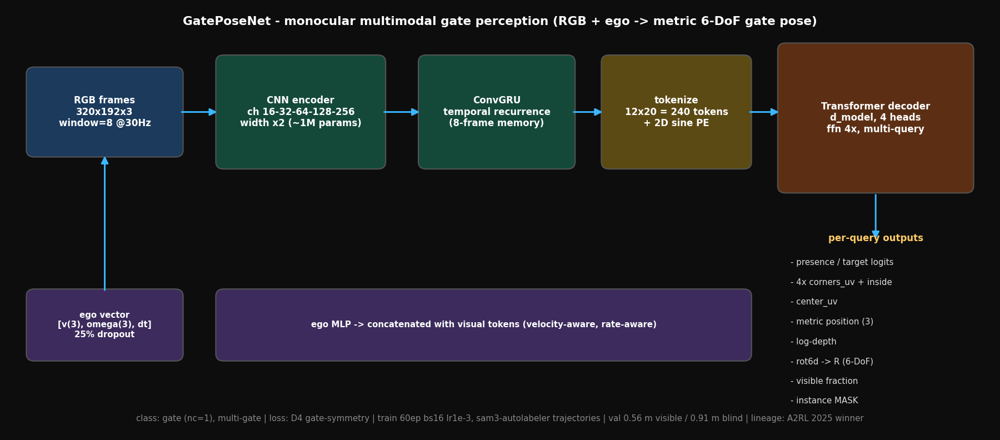
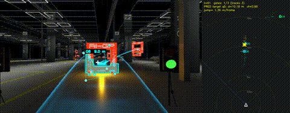
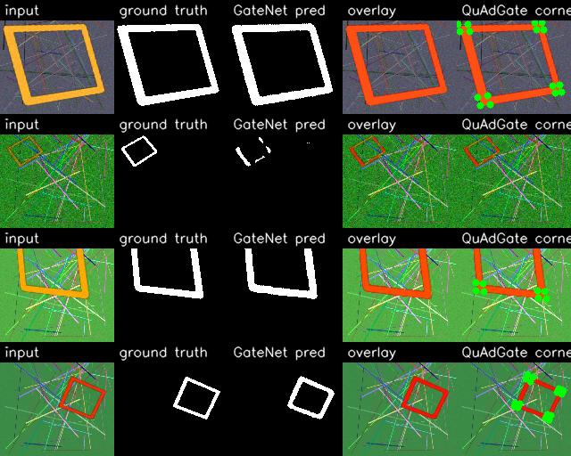
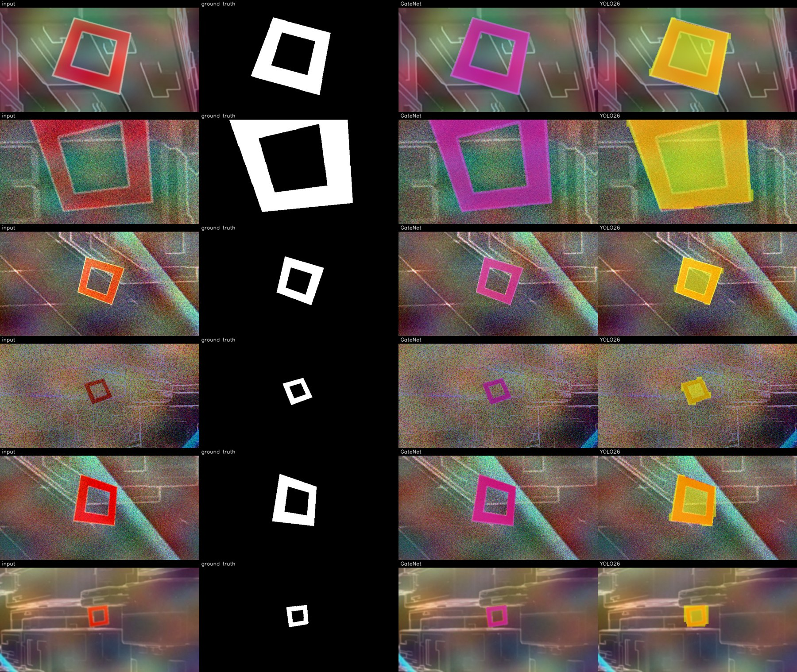
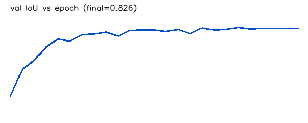

> **Canonical-data vanilla baseline:** The original `GatePoseNetSingle` architecture is unchanged. For the canonical data/output contract see [`VANILLA_CONTRACT.md`](VANILLA_CONTRACT.md). For the exact **Isaac-only** and **Synthetic+Isaac** cheap → baseline → Optuna → final command sequence, use [`VANILLA_TRAINING.md`](VANILLA_TRAINING.md). The experiment configs are `configs/vanilla/isaac.yaml` and `configs/vanilla/combined.yaml`. Visual inference for every training stage is documented in [`VANILLA_INFERENCE.md`](VANILLA_INFERENCE.md).

## Vanilla GatePoseNet experiment protocol (Sep 2026)

The canonical vanilla workflow now supports two directly comparable data regimes:

- Isaac only: `../data/refined_isaac_0908`
- Synthetic + Isaac: `../data/synth_large_0906` + `../data/refined_isaac_0908`

The fixed funnel is **15%/8 epochs cheap**, **50%/30 epochs baseline**, **the same 50% for Optuna (20 × 15 epochs)**, then **100%/60 epochs final**. Sequence subsets use seed 42, the test split remains untouched until final evaluation, run directories go under `../runs_vanilla`, and reports/inference outputs go under `../outputs_vanilla`. See [`VANILLA_TRAINING.md`](VANILLA_TRAINING.md) for every CLI command.

---

# gateNET

Training, testing and deployment infrastructure for **GateNet** — a lightweight
U-Net gate-segmentation network for autonomous drone racing — plus the
**QuAdGate** corner detector and **PnP** pose solver that form the geometric
perception front-end.

This is a faithful re-implementation of the GateNet/perception stack described in:

- **MonoRace** — Bahnam et al., *"Winning Champion-Level Drone Racing with Robust
  Monocular AI"* (A2RL 2025). Authoritative GateNet training recipe + QuAdGate +
  PnP. *(Won the 2025 Abu Dhabi A2RL competition, beating 3 human world champions.)*
- **SkyDreamer** — Verraest et al., [arXiv:2510.14783](https://arxiv.org/abs/2510.14783).
  Reuses the same GateNet (Appendix A).

Masks are produced upstream by the
[sam3-autolabeler](https://github.com/airobotics-ucberkeley/sam3-autolabeler)
(SAM 3, prompt = "racing gate"); this repo consumes a standard `images/ + masks/`
dataset (see [`data/README.md`](data/README.md)).

---

## Architecture

```
 RGB image (384x384)
      │
      ▼
 ┌──────────┐   binary mask    ┌───────────┐  corners   ┌──────┐  pose
 │ GateNet  │ ───────────────▶ │ QuAdGate  │ ─────────▶ │ PnP  │ ─────▶ (to EKF / control)
 │  (U-Net) │  {y0..y4}        │ (corners) │            │      │
 └──────────┘  deep supervised └───────────┘            └──────┘
```

### GateNet (`gatenet/`)
- U-Net encoder/decoder, `double-conv → BN → ReLU` blocks, skip connections
  **added** (not concatenated) — keeps it lightweight.
- **5 deep-supervised outputs** `{y0..y4}`; only the highest-res `y0` is used at
  deploy time.
- Loss `Lᵢ = Dice + 2·BCE`, total `4·L0 + 2·L1 + L2 + L3 + L4`.
- Xavier-uniform init; widths scaled by factor `f` (**f=4 ≈ 1.75M params**,
  **f=2 ≈ 0.44M params**).
- Training recipe (MonoRace): **384×384, AdamW, batch 16, 100 epochs, base LR
  1e-3 → ×√0.1 at epochs 10/33/66/90 → 1e-5.**

> **Channel widths:** the papers give exact per-layer channel counts only in a
> figure we couldn't OCR, stating widths "scale by `f`". We parametrise
> `channels = base · f / 4` (so f=4 = nominal). Set `model.channels` explicitly
> in a config if you know the true counts.

### QuAdGate + PnP (`perception/`)
- LSD line detection (scale 0.8, σ_scale 0.8, quant 25, ang_th 30) → extend ×5/3
  → line intersections = sub-pixel corner candidates (robust to rounded masks).
- 4-value corner descriptors → match to projected priors → RANSAC partial-affine
  (thresh 5px, reject translation > 150px).
- Multi-gate PnP (`cv2.solvePnP[Ransac]`) on the A2RL square gate geometry
  (inner 1.5m / outer 2.7m).

---

## Setup (uv + GPU)

This project uses [uv](https://docs.astral.sh/uv/). On a **Linux GPU server**
torch is pulled from the **CUDA 12.4** wheel index automatically; on macOS it
falls back to CPU wheels (the lockfile pins both).

```bash
# on the remote GPU server
git clone <this repo> && cd gateNET-1
uv sync                       # creates .venv with torch 2.6.0+cu124
uv run python scripts/check_gpu.py   # verify CUDA is visible
```

To target a different CUDA version, edit the index URL in `pyproject.toml`
(e.g. `.../whl/cu121`) and re-run `uv lock && uv sync`.

Optional extras: `uv sync --extra export` (ONNX), `uv sync --extra dev` (pytest).

---

## Usage

All commands run under the uv env via `uv run` (GPU is auto-selected).

```bash
# 1. Train  (data per data/README.md; GPU used automatically)
uv run python scripts/train.py --config configs/gatenet_a2rl.yaml

# 2. Evaluate a checkpoint (IoU / Dice / precision / recall)
uv run python scripts/test.py  --config configs/gatenet_a2rl.yaml \
    --checkpoint runs/gatenet_a2rl/best.pt --data data/test

# 3. Inference (mask + overlay) on an image or folder
uv run python scripts/infer.py --config configs/gatenet_a2rl.yaml \
    --checkpoint runs/gatenet_a2rl/best.pt --input frame.jpg --output infer_out/

# 4. Full perception demo (GateNet -> QuAdGate corners)
uv run python scripts/demo_perception.py --config configs/gatenet_a2rl.yaml \
    --checkpoint runs/gatenet_a2rl/best.pt --input frame.jpg

# 5. Export for onboard deployment
uv run python scripts/export_onnx.py --config configs/gatenet_a2rl.yaml \
    --checkpoint runs/gatenet_a2rl/best.pt --output gatenet.onnx
#   then on the Jetson:  trtexec --onnx=gatenet.onnx --saveEngine=gatenet.plan --fp16

# scaling report (params/latency vs f)
uv run python scripts/scaling_report.py --device cuda

# tests
uv run python -m pytest tests/ -q
```

### Fine-tuning to a new gate / venue

Adapt a base model to a **new gate type, hall, or lighting** with a small
labeled set — the regime MonoRace/SkyDreamer use to move between gate types.
`scripts/finetune.py` loads pretrained weights (not optimizer/epoch) and trains
at a lower LR, with three knobs (`configs/gatenet_finetune.yaml` or CLI flags):

| Regime | Flag | When |
|--------|------|------|
| Gentle full fine-tune (encoder LR ×0.1) | *(default)* | moderate new data |
| Train decoder + heads only | `--freeze-encoder` | very little data |
| Re-initialise output heads | `--reset-heads` | very different appearance |

```bash
uv run python scripts/finetune.py --config configs/gatenet_finetune.yaml \
    --pretrained runs/gatenet_a2rl/best.pt --freeze-encoder
```

(`--resume` on `train.py` is different — it *continues the same run*, not a
domain adaptation.)

### Configs
| Config | Resolution | f | Params | Notes |
|--------|-----------|---|--------|-------|
| `configs/gatenet_a2rl.yaml`   | 384×384 | 4 | ~1.75M | MonoRace recipe, full-res output |
| `configs/gatenet_mavlab.yaml` | 196×196 | 2 | ~0.44M | SkyDreamer variant, output resized to 64×64 |

---

## Data

GateNet consumes `images/ + masks/` produced by the upstream pipeline. The
synthetic↔real mix (MonoRace **3500:500**) is a *dataloader* setting here
(`data.mode: merged`, `data.ratio`); data *generation* lives upstream in
sam3-autolabeler. A fallback compositor (`scripts/make_synthetic.py`) exists for
smoke tests. Full contract: [`data/README.md`](data/README.md).

---

## Layout

```
gatenet/        model, deep-supervised loss, dataset, augment, synth, metrics,
                schedule, engine (shared loop), finetune (domain adaptation)
perception/     quadgate (corners), pnp (pose)
scripts/        train, finetune, test, infer, export_onnx, demo_perception,
                make_synthetic, make_poc, scaling_report, check_gpu
configs/        gatenet_a2rl.yaml, gatenet_mavlab.yaml, gatenet_finetune.yaml
tests/          model, quadgate/pnp, finetune smoke tests
data/           dataset contract (README)
docs/           results.md + eval_comparison.jpg + eval_perception.jpg
```

## Not included (next steps)
The full MonoRace system also has an EKF state estimator and a PPO-trained
G&CNet motor controller + quadcopter simulator. This repo stops at the
perception front-end (GateNet + QuAdGate + PnP), per scope. Those are the
natural next modules to add.

## GatePoseNet gallery

Parent issue: #2. Discussion: airobotics-ucberkeley/docs#83.

### Architecture (RGB + ego -> metric 6-DoF gate pose)


### Track + map inference


### Training / eval samples



